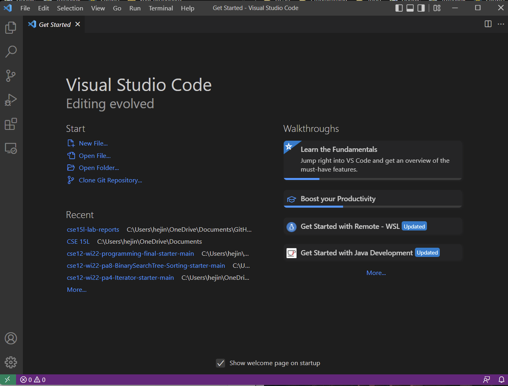
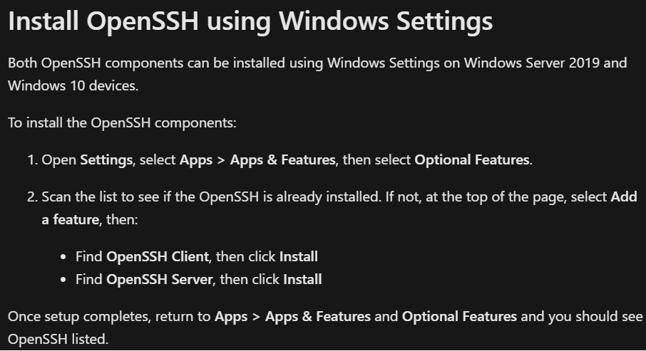
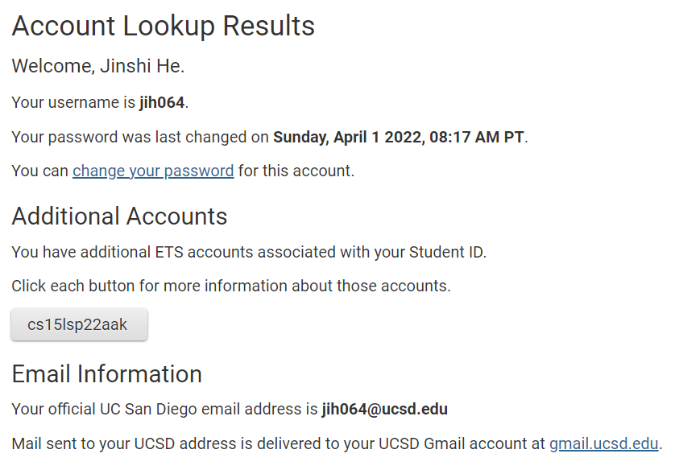

# Introduction
This is the tutorial about how to log into a course-specific account on ieng6 for incoming 15L students. There are a total of 6 steps in this tutorial and it would only take about 30 minutes to complete.

---

# 1. Installing VScode (~2 minutes)
1. Go to the [Visual Studio Code website](https://code.visualstudio.com/), and follow the instruction to download and install it to your computer
2. When it is successfully installed, you should be able to open a window that looks like this

> * The window might have different colors, or a different menu bar, depending on your system and setting

# 2. Remotely Connecting (~10 minutes)
1. Install OpenSSH with this [tutorial](https://docs.microsoft.com/en-us/windows-server/administration/openssh/openssh_install_firstuse)
> * Since I am using a Windows laptop, the tutorial I will be demonstrating is all Windows version. Mac users have to stick to their version of tutorial.
> * Follow these particular steps in listed in the picture
> 
2. Look up your course-specific account for CSE15L [here](https://sdacs.ucsd.edu/~icc/index.php)
> * After typing your username and ID into the box, you will see the following page
> 
> * You will see your couse-specific account under additional accounts
3. Open a terminal in VSCode (Ctrl + `, or use the Terminal -> New Terminal menu option). You would enter the following command but with the zz relaced by the letters in your course-specific aacount. 
```
$ ssh cs15lsp22zz@ieng6.ucsd.edu
```
> * if your connect to the server for the first time, you may see the message asking if you want to continue connecting.
> * type yes and press enter, then give your password
4. Now your terminal should be connected to a computer in the CSE basement, and any commands should be run on that computer too. 

# 3. Trying Some Commands (~5 minutes)
1. `cd`: command that allows for change of the current working directory of a shell instance
> Syntax: `cd [dirname]`
2. `ls`: command that lists files and directories within the file system, and shows detailed information about them.
> Syntax: `ls [options] [files]`
3. `cp`: command used to copy files or group of files or directory
> Syntax:
> * `cp [option] Source Destimation`
> * `cp [option] Source Directory`
> * `cp [option] Source-1 Source-2 Source-3 Source-n Directory`
4. `cat`: command that reads data from the file and gives their content as output
> Syntax: `cat [filename]`

# 4. Moving Files with `scp` (~2 minutes)
1. Create a java file on your local computer
2. move that java file to the server with the following command with zz replaced by your course-specific code
```
scp [filename] cs15lsp22zz@ieng6.ucsd.edu:~/
```
3. You should be prompted for a password just like when you log in with `ssh`
4. Log into ieng6 again, and use `ls`. You should see the file that you just copied
5. Now you can run that java file *on the ieng6 computer* using `javac` and `java`

# 5. Setting an SSH Keys (~10 minutes)
1. On client (your local computer), enter the follwing command 
```
ssh-keygen
```
2. You will see `Enter file in which to save the key`, enter the follwoing code
```
(/Users/<user-name>/.ssh/id_rsa): /Users/<user-name>/.ssh/id_rsa
```
3. You will then see `Enter passphrase (empty for no passphrase)`, press enter directly
4. Press enter again to confirm the empty paraphrase
5. Now we need to copy the public key to the `.ssh` directory of your user account on the server by going through the following steps
```
$ ssh cs15lsp22zz@ieng6.ucsd.edu
<Enter Password> // now on server
$ mkdir .ssh
$ <logout> // back on client
$ scp /Users/<user-name>/.ssh/id_rsa.pub cs15lsp22zz@ieng6.ucsd.edu:~/.ssh/authorized_keys
  // You use your username and the path you saw in the command above
```
6. Once you have done all previous steps, you should be able to `ssh` or `scp` from this client to the server without entering your password

# 6. Optimizing Remote Running (~1 minute)
1. You could write a command with quotes at the end of an `ssh` command to directly run it on the remote server. Here is an example:
```
$ ssh cs15lsp22zz@ieng6.ucsd.edu "ls"
```
2. You can use semicolons to run multiple commands on the same line in most terminals. Here is an example:
```
$ cp WhereAmI.java OtherMain.java; javac OtherMain.java; java WhereAmI
```
3. You can use up-arrow on the keyborad to recall the last command that was run.

