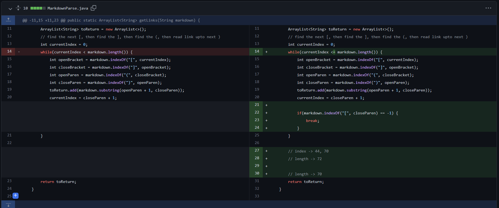

# Introduction
This is a brief demonstration of how me and my partner colloborate together to fix a bug in lab 3. A total of three code changes would be present here with corresponding explanation

---

# Code Change #1
1. Screenshot of the code change

2. Link to the test file for a failture-inducing input:
[test-file.md](https://github.com/SouKangC-school/markdown-parser/commit/c3ea6387a9e3c5b7e50eaa9766cf3f3e9b2e5897)
3. Symtoms:

