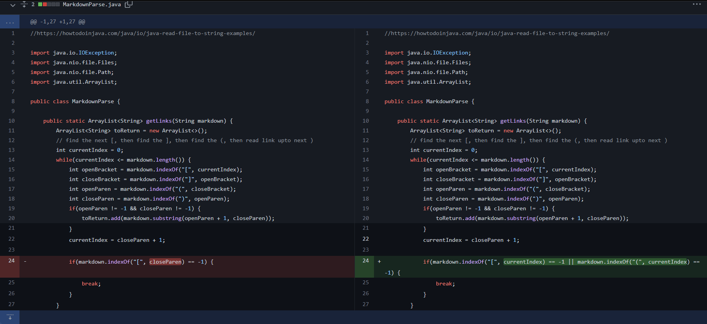

# Introduction
This is a brief demonstration of how me and my partner colloborate together to fix a bug in lab 3. A total of three code changes would be present here with corresponding explanation

---

# Code Change #1
1. Screenshot of the code change

2. Link to the test file for a failture-inducing input:
[test-file.md](https://github.com/SouKangC-school/markdown-parser/commit/c3ea6387a9e3c5b7e50eaa9766cf3f3e9b2e5897)
3. Symtoms:
Infinite loop caused by the empty line

4. Description:
As we can see from the test-file, the infinite loop symptom would always appear if there is an empty line at the end. Such bug exists because the empty line would always prevent the currentIndex from reaching higher than the total length of the markdown file. The solution is to add a condition to determine if there are still left bracket ([) present after the currentIndex.

# Code Change #2
1. Screenshot of the code change

2. Link to the test file for a failture-inducing input:
[test-2.md](https://github.com/SouKangC-school/markdown-parser/commit/c59c8b34a0e6655bd058536450ef4d097dfbec54) 
3. Symtoms:
No links in file causes IndexOutOfBounds error

4. Description:
The IndexOutOfBounds would pop out if there is no link present in a certain test file. The issue here is that if there is no parenthesis after a set of bracket, the program would try to perform `markdown.substring(0,-1)`, which would causes indexOutOfBound error. The solution here is to add an if statement to determine whether parenthesis is detected and add string only when parenthesis is present.

# Code Change #3
1. Screenshot of the code change

2. Link to the test file for a failture-inducing input:
[test-2.md](https://github.com/SouKangC-school/markdown-parser/commit/c59c8b34a0e6655bd058536450ef4d097dfbec54) 
3. Symtoms:
Infinite loop casued by file with no link at all

4. Description:
For the file with no link at all we detect that program would enter into an infinite loop just like what it does in code change #1. After examination, it turns out that the final if statement that detect whether we reaches the end of the file is not comprehensive enough. To fix the issue, we modfify the if condition from 
`markdown.indexOf("[", closeParen) == -1` to `markdown.indexOf("[", currentIndex) == -1 || markdown.indexOf("(", currentIndex) == -1`